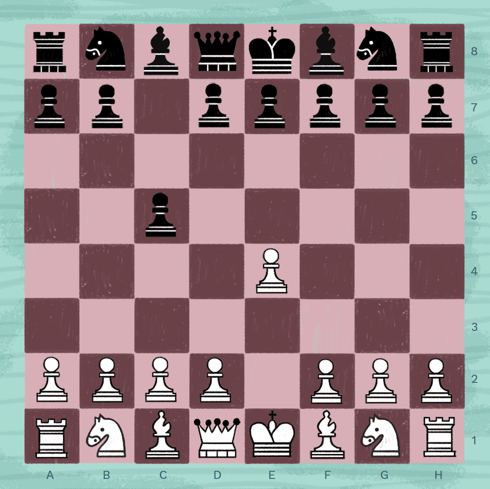

# David Liu's User Page
## Author: David Liu
This is the unofficial user page of **David Liu**. 

David is a *Junior* undergrad ~~Math~~ CS student in UCSD. 

**David's favorite manga series of all time is *Attack on Titan***. 

***Currently, David is still adjusting to the CS working environment and tools, so he is extremely noob in every CS related topic.***

As the great mathematician David Hilbert once said: 
> Wir müssen wissen. 
> Wir werden wissen.

I am currently learning `git` related commands and tools. 

My most hated code block of all time:
```c++
if (true) {
    return true;
}

else {
    return false;
}
```
The problem that I want to touch on one day: [Riemann Hypothesis](https://en.wikipedia.org/wiki/Riemann_hypothesis)

This is a link to return to the top: [top](#david-lius-user-page)

This is a link to my README file: [README](README.md)

This is my favorite chess opening. 


My hobbies are: 
- Working out
- Playing chess
- Playing the piano 
- Hanging out with friends

Ordering from most to least favorite:
1. Working out
2. Playing the piano
3. Playing chess
4. Hanging out with friends

Things that I need to do this week; 
- [x] Finish my homework
- [ ] Write emails to professor
- [ ] Preview class material for next week

